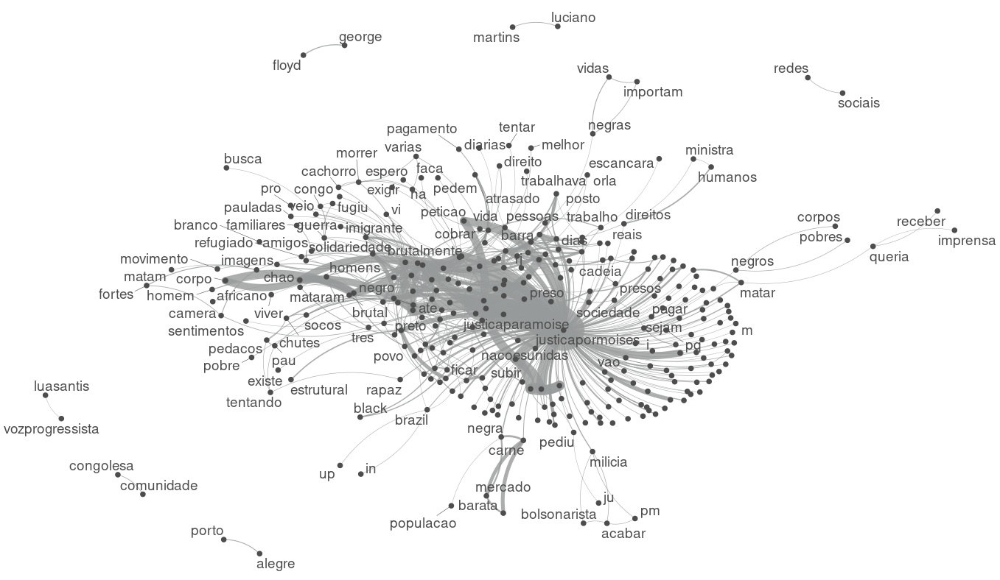

# Lexical Network

## Introduction

This tutorial provides information regarding data scrapin for the article:

**Representations of Violence against a Black Migrant on Twitter** By [Rodrigo Esteves de Lima Lopes](mailto:rll307@unicamp.br) (CNPq/UNICAMP) and [Vivian Gomes Monteiro Souza](mailto:viviangomesms@gmail.com) (CNPq/UNICAMP).

The article is currently under review by the journal. Once it is published, we will update this page.

## What do we need?

-   The data we have collected running a Tweeter [Data scraping script](01_DataScraping.md)
-   Some packages:
    -   quanteda
        -   Text processing
    -   quanteda.textplots
        -   Text plotting
    -   quanteda.textstats
        -   Corpus Statistics
    -   tidytext and dplyr
        -   Data manipulation

## The analysis

Importing the data

```         
tweets.moise <- tweets
```

# Extracting textual data only

```         
tweets.moise <- tweets.moise$text
```

Excluding accents, removing special characters and lowcasing, so data is better processed:

```         
tweets.moise <- abjutils::rm_accent(tweets.moise)
tweets.moise <- tolower(tweets.moise)
tweets.moise <- stringr::str_replace_all(tweets.moise,"[^a-zA-Z\\s]", "")
```

Creating a data frame, deleting repeated data and renaming the column

```         
tweets.moise.df <- data.frame(tweets.moise)
names(tweets.moise.df)[1] <- "Tweet"
tweets.moise.df <- tweets.moise.df %>%
  distinct()
```

# Sum of tokes and types

```         
n.tokens.moise <- ntoken(tweets.moise.tokens)
sum(n.tokens.moise) #135.388
n.type.tokens.moise <- ntype(tweets.moise.tokens)
sum(n.type.tokens.moise) #131.371
```

Creating a dfm and a fcm. We also select the 500 more frequent words

```         
tweets.moise.dfm <- dfm(tweets.moise.tokens)
tweets.moise.top <- names(topfeatures(tweets.moise.dfm, 500))

tweets.moise.fcm <- fcm(
  tweets.moise.tokens,
  context = 'window',
  count = "frequency",
  window = 2L,
  weights = NULL,
  ordered = FALSE,
  tri = TRUE
)
tweets.moise.fcm.top <- fcm_select(tweets.moise.fcm , pattern = tweets.moise.top)
```

Plotting

```         
textplot_network(tweets.moise.fcm.top, min_freq = 15, edge_color = "#979A9A", edge_alpha = 0.8, edge_size = 5)
```



An R script for this tutorial is available [here](03_network.R)


