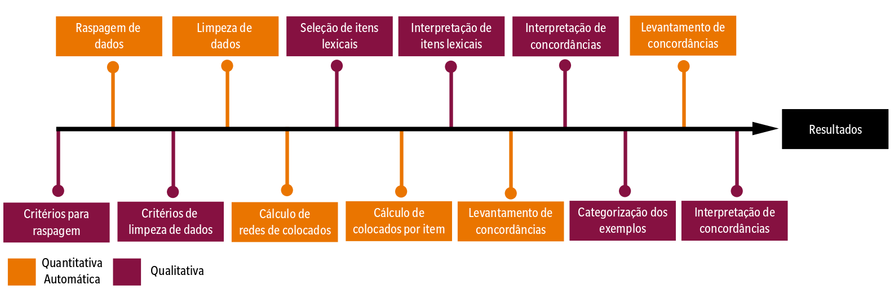

# README

## Introduction

This repository contains the scripts written for our article:

**Representations of Violence against a Black Migrant on Twitter** By [Rodrigo Esteves de Lima Lopes](mailto:rll307@unicamp.br) (CNPq/UNICAMP) and [ Vivian Gomes Monteiro Souza](mailto:viviangomesms@gmail.com) (CNPq/UNICAMP).

The article is currently under review by the journal. Once it is published, we will update this page.

### Contents

In this repository, you will find scripts for:

1.  Data scraping - [here](01_DataScraping.md)
2.  Calculation of collocates - [here](02_collocates.md)
3.  Calculation of collocates networks - [here](03_network.R)

## Disclaimer

Tweeter has recently closed its API for academic research. This study, therefore, cannot be replicated. We hope it changes in the future. 

## Methodological notes

This research relies on mixed methods, adding another layer of interpretation to the qualitative analysis by embracing quantitative methods.[^readme-1] Therefore, mixed methods could be defined as integrating qualitative and quantitative approaches in a single study, exploring the data and research themes from multiple angles.[^readme-2] The application of combined methods allows, consequently, to take a step towards a more comprehensive observation, taking advantage of contributions from both approaches.

[^readme-1]: Mackey, Alison, and Lara Bryfonski. 2018. "Mixed Methodology." In *The Palgrave Handbook of Applied Linguistics Research Methodology*, edited by Aek Phakiti, Peter De Costa, Luke Plonsky, and Sue Starfield, 103--21. London: Palgrave Macmillan UK. <https://doi.org/10.1057/978-1-137-59900-1_5>.

[^readme-2]: Creswell, John W., and J. David Creswell. 2018. *Research Design: Qualitative, Quantitative, and Mixed Methods Approaches*. Fifth edition. Los Angeles: SAGE.

According to Biber and colleagues,[^readme-3] research in Corpus Linguistics can traditionally be viewed as a mixed approach since quantitative data in the field of language science depend not only on the analyst's perspective for interpreting the presented categories but also for understanding their implications.

[^readme-3]: Biber, Douglas, Susan Conrad, and Randi Reppen. 1998. *Corpus Linguistics: Investigating Language Structure and Use*. Cambridge Approaches to Linguistics. Cambridge ; New York: Cambridge University Press.

This paper adopts what Creswell and Creswell[^readme-4] and Mackey and Bryfonski[^readme-5] define as a sequential method in which quantitative and qualitative analyses are sequentially alternated. The idea behind this perspective is that these approaches complement each other regarding data scraping, analysis, and interpretation.

[^readme-4]: Creswell, John W., and J. David Creswell. 2018. *Research Design: Qualitative, Quantitative, and Mixed Methods Approaches*. Fifth edition. Los Angeles: SAGE.

[^readme-5]: Mackey, Alison, and Lara Bryfonski. 2018. "Mixed Methodology." In *The Palgrave Handbook of Applied Linguistics Research Methodology*, edited by Aek Phakiti, Peter De Costa, Luke Plonsky, and Sue Starfield, 103--21. London: Palgrave Macmillan UK. <https://doi.org/10.1057/978-1-137-59900-1_5>.

Figure 1 below provides an overview of this methodological process.

## Acknowledgements

We would like to thank CNPq (Brazilian National Council for Scientific and Technological Development) for supporting this research.
